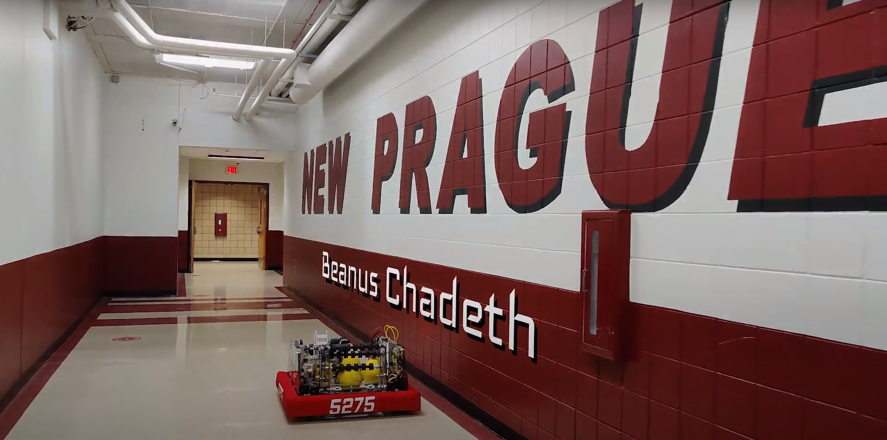

# FRC Team T.I.M.E Bots #5275 - 2021-2022 Robot Code
Contact Us: [our website](https://www.timebots5275.com) | [email](mailto:team@timebots5275.com)  
 

## Robot Information  
Name: Krónos  
Year: 2021-2022  
Team: T.I.M.E Bots 5275  

# 2021-2022 Robot Specifications
[Robot Specifications 2021-2022 Google Doc](https://docs.google.com/document/d/1EWv7gEj-2pS71mKx4Zu3d4CnA1jr-3asu2jorQIAOFM/edit#)

## Subsystems  
| Subsystems | Description         |
| ---------- | ------------------- |
| Drivetrain | Motors: 8 SPARK MAX |
| Intake     | Motors: 1 Talon SRX |
| Hopper     | Motors: 2 Talon SRX |
| Shooter    | Motors: 2 SPARK MAX |
| Climber    | Motors: 3 SPARK MAX |

# Code Formatting
All subsystem folders should be lower case.  
All command the folders should be lower case
